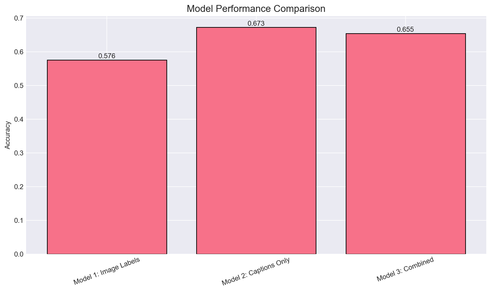

# 🏀 Texas Women’s Basketball Instagram Engagement Analysis 🏀
**Unstructured Data · Web Scraping · Computer Vision · Text Analytics · Classification**

**Project Type:** Unstructured Data Analysis + Classification  
**Tools:** Python, Selenium, BeautifulSoup, Pandas, Google Vision API, Scikit-learn, LDA  
**Data:** 500+ Instagram posts from UT Women’s Basketball  
**Output:** Engagement prediction + content strategy insights  

---

## Project Overview

Social media is one of the primary ways collegiate athletic programs connect with fans, recruits, and alumni. For Texas Women’s Basketball, Instagram plays a key role in telling the program’s story — from game action and player moments to announcements and branding.

This project analyzes how **visual content and caption text** influence Instagram engagement for the University of Texas Women’s Basketball team. Starting from raw, publicly available Instagram content, I built an end-to-end pipeline that **scrapes posts, extracts visual and textual signals, trains predictive models, and translates results into actionable content strategy insights.**

The goal is not just prediction, but insight:  
**What should the program post more of — and why?**

---

## Business Question

**Which types of Instagram posts generate higher engagement for Texas Women’s Basketball, and what content characteristics consistently drive strong performance?**

---

## Pipeline at a Glance

**Scrape Instagram posts → label images → process captions → define engagement → train classifiers → interpret features → uncover themes → recommend content strategy**

---

## Data & Problem Setup

### Data Sources and Collection
Because Instagram data is not directly available as a structured dataset, posts were collected using **web scraping and browser automation**. Using **Selenium** and **BeautifulSoup**, I scraped over **500 posts** from the official UT Women’s Basketball Instagram account.

For each post, the following fields were collected:
- **Image URL** (visual content)  
- **Caption text** (language, hashtags, emojis)  
- **Number of likes** (engagement metric)

This mirrors a real-world analytics scenario where data must be assembled from **unstructured, dynamic webpages** before any modeling can begin.

### Engagement Definition
To frame this as a classification problem, engagement was defined **relative to the account’s own performance**:
- Posts above the median number of likes → **High engagement**
- Posts below the median → **Low engagement**

This avoids arbitrary thresholds and focuses on what outperforms typical content.

**Visual (recommended):**  

---

## Feature Construction (Unstructured → Structured)

### Image Labeling (Computer Vision)
Each Instagram image was processed using the **Google Vision API**, which extracts descriptive labels representing what appears in the image (e.g., basketball game, celebration, crowd, athlete).

This step converts raw visual content into **model-ready textual features** while preserving interpretability.

### Caption Text Processing
Caption text was cleaned and vectorized using a **Bag-of-Words** approach, capturing:
- Keywords  
- Hashtags  
- Emojis and short hype phrases  

Together, image labels and captions provide two complementary views of each post:
- **What the image shows**
- **How the post tells the story**

**Visual (recommended):**  

---

## Engagement Prediction (Logistic Regression)

To understand which sources of information are most predictive of Instagram engagement, three logistic regression models were trained, each using a different feature set:
- **Image labels only** (visual content from Google Vision API)  
- **Captions only** (text, hashtags, emojis)  
- **Combined image labels + captions**  

Each model predicts whether a post will receive high or low engagement, defined relative to the account’s median likes.

### Model Results
Across all models, **caption-based features** consistently outperformed **image-only features**, indicating that **language and context** play a stronger direct role in engagement than visual descriptors alone. However, **image content** still contributed meaningful signal, particularly for emotionally charged or dynamic posts.

**Test performance (Accuracy):**
- **Image labels only:** 60.00%  
- **Captions only:** 64.85%  
- **Combined (labels + captions):** 64.85%  

---

## Evaluation & Model Selection (Condensed)

The dataset consisted of **548 total posts** (**383 train / 165 test**) with a nearly balanced target (**275 high vs 273 low**), so accuracy was a reasonable baseline metric.

However, for social media strategy, the priority is **surfacing posts likely to perform well** — meaning **missing a high-performing post (false negative)** is more costly than occasionally flagging a lower-performing post.

Even though the captions-only and combined models had the same accuracy, confusion-matrix review showed the **combined model** did a **better job detecting high-engagement posts**, so it was selected as the preferred approach.

**Visual (recommended):** 

---

## Interpreting Content Themes (Topic Modeling)

Prediction alone doesn’t explain why posts succeed. To uncover underlying patterns, **Latent Dirichlet Allocation (LDA)** was applied to the image labels to identify recurring visual themes across posts.

A **3-topic** solution was selected to balance interpretability and coverage. Each post was represented as a mixture of these topics, allowing comparison between **high- vs low-engagement** content themes.

The three discovered topics can be summarized as:
- **Topic 1 – Posters & Branding:** game posters, announcement graphics, branded visuals  
- **Topic 2 – Off-Court / Behind the Scenes:** team moments, people-focused content, non-game settings  
- **Topic 3 – In-Game / Live Action:** gameplay, on-court action, competitive moments  

### High vs Low Engagement Themes (Key Finding)
Topic proportions showed clear differences:
- **High-engagement posts skewed more toward Off-Court / Behind-the-Scenes and In-Game content**
- **Low-engagement posts skewed more toward Posters & Branding**
- Off-court content acted as a strong differentiator in the higher-performing posts

**Visual (recommended):**  

---

## Insights & Recommendations

### What Works Best
- Posts featuring **players in motion or celebration**
- Content that captures **emotion, energy, and connection**
- Captions that add **narrative** or highlight key moments

### What Underperforms
- Static promotional graphics
- Low-context announcements without storytelling

### Content Strategy Recommendations
- Prioritize **in-game and post-game moments**
- Pair visuals with captions that **tell a story**, not just deliver information
- Use branding graphics selectively and support them with compelling language
- Lean into **emotion and fan connection** rather than purely informational posts

---

## Why This Matters

This project demonstrates how unstructured data — images and text — can be transformed into actionable insights using modern analytics techniques. Rather than guessing what content works, the approach provides a data-driven framework for shaping social media strategy in collegiate athletics.

The same workflow can be applied to:
- Professional sports teams
- Brand social media accounts
- Marketing and content analytics teams

---

## Tools & Skills Demonstrated

- **Web Scraping & Data Collection:** Selenium, BeautifulSoup  
- **Computer Vision:** Google Vision API  
- **Text Analytics:** Bag-of-Words / vectorization  
- **Classification Modeling:** Logistic Regression (scikit-learn)  
- **Topic Modeling:** LDA  
- **Business Translation:** turning model output into content strategy recommendations  

---

## Files in This Repo
- **Notebook:** `Final_2026_send.ipynb`
- **Report:** `reports/Final_2026_send.pdf`
- **Figures:** `figures/`

