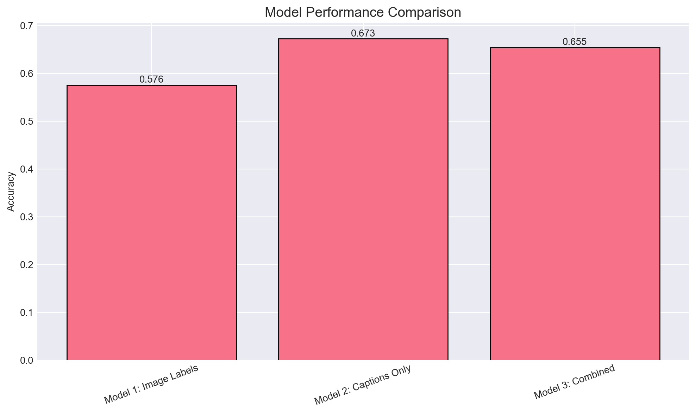
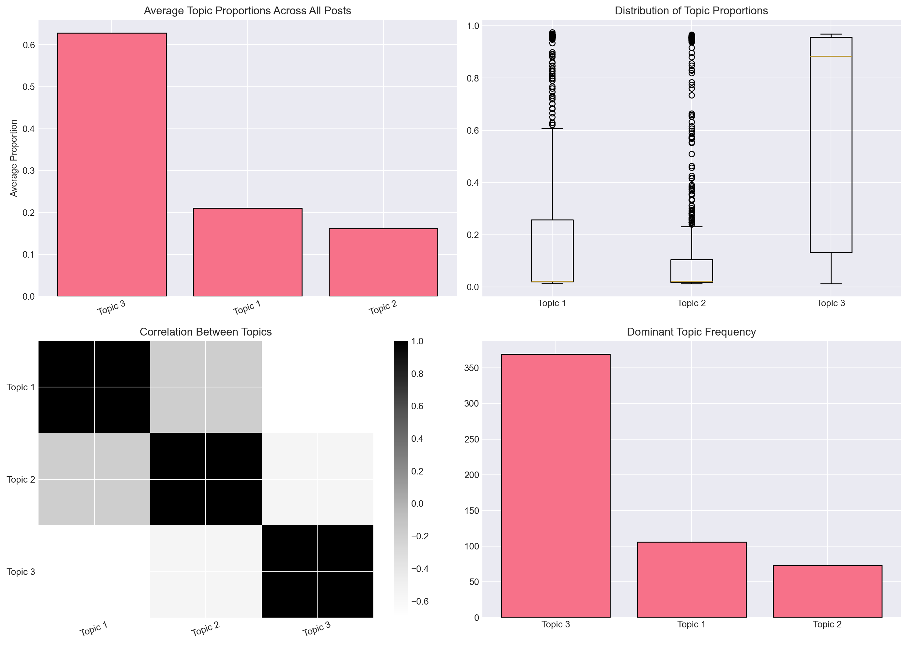

# 🏀 Texas WBB Instagram Engagement Analysis

> What should UT Women's Basketball post more of — and why? An end-to-end pipeline from web scraping to content strategy using computer vision, NLP, and classification modeling on 500+ Instagram posts.

**Tech:** Python · Selenium · BeautifulSoup · Google Vision API · scikit-learn · LDA · pandas · Matplotlib

---

## Key Findings

| Insight | Detail |
|---------|--------|
| **Captions > Images** for predicting engagement | Caption features alone matched the combined model at 64.85% accuracy |
| **Behind-the-scenes content wins** | Off-court / player moments were the strongest differentiator for high engagement |
| **Static graphics underperform** | Posters and branded announcements consistently skewed toward low engagement |
| **Best model: Combined (Vision + Text)** | Same accuracy as captions-only, but better recall on high-engagement posts |

---

## The Problem

Social media teams post daily but rarely have data-driven guidance on *what actually works*. This project builds a pipeline that starts from raw Instagram content and ends with actionable recommendations — not just predictions, but **strategy**.

**Business question:** Which types of Instagram posts generate higher engagement for Texas Women's Basketball, and what content characteristics consistently drive strong performance?

---

## Pipeline

```
Scrape 500+ posts (Selenium + BeautifulSoup)
    → Label images (Google Vision API)
    → Process captions (Bag-of-Words)
    → Define engagement (above/below median likes)
    → Train classifiers (Logistic Regression)
    → Discover themes (LDA topic modeling)
    → Translate into content strategy
```

---

## Data

**Source:** 500+ posts scraped from the official [@texaswbb](https://www.instagram.com/texaswbb/) Instagram account using Selenium browser automation.

| Field | Type | Role |
|-------|------|------|
| Image | Unstructured (visual) | Processed via Google Vision API → descriptive labels |
| Caption | Unstructured (text) | Cleaned, vectorized via Bag-of-Words |
| Likes | Numeric | Binary target: above median = High, below = Low |

**Split:** 383 train / 165 test · Nearly balanced (275 high vs 273 low)

---

## Feature Engineering: Unstructured → Structured

**Images:** Each photo passed through the **Google Vision API**, which extracts labels like *basketball game*, *celebration*, *crowd*, *athlete*. This converts raw pixels into model-ready text features while preserving interpretability.

**Captions:** Cleaned and vectorized using Bag-of-Words — capturing keywords, hashtags, emojis, and short hype phrases.

These two feature sets give complementary views of every post: *what the image shows* vs. *how the post tells the story*.

---

## Classification Results

Three logistic regression models, each with a different feature set:

| Model | Accuracy | Strength |
|-------|----------|----------|
| Image labels only | 60.0% | Captures visual content type |
| Captions only | 64.85% | Language and context are more predictive |
| **Combined (labels + captions)** | **64.85%** | **Better high-engagement recall** ✅ |

The combined model was selected because confusion matrix analysis showed it **caught more high-performing posts** — the outcome that matters most for a social media team.



---

## Topic Modeling: Why Do Posts Succeed?

Prediction alone doesn't explain *why*. **LDA (Latent Dirichlet Allocation)** was applied to image labels to uncover recurring visual themes. A 3-topic solution balanced interpretability and coverage:

| Topic | Theme | Engagement Signal |
|-------|-------|-------------------|
| **Topic 1** | Posters & Branding | ⬇️ Skews low engagement |
| **Topic 2** | Off-Court / Behind the Scenes | ⬆️ Strongest high-engagement differentiator |
| **Topic 3** | In-Game / Live Action | ⬆️ Skews high engagement |



---

## Content Strategy Recommendations

### Post more of ✅
- Players in motion or celebration — emotion and energy
- Behind-the-scenes team moments and off-court connection
- Captions that **tell a story**, not just deliver information
- In-game and post-game moments

### Post less of ⬇️
- Static promotional graphics without context
- Low-context announcements without storytelling
- Branding-heavy posts without compelling language

---

## Repository Structure

```
├── ut_womens_basketball_final.ipynb    # Full analysis pipeline
├── cleaned_data_with_image_labels.xlsx # Processed dataset
├── figures/                            # Charts and visualizations
│   ├── model_comparison.png
│   └── lda_topic_visuals.png
├── outputs/                            # Model outputs
└── README.md
```

---

## How to Run

```bash
git clone https://github.com/awhite121/ut-wbb-instagram-engagement.git
cd ut-wbb-instagram-engagement
pip install pandas numpy scikit-learn matplotlib seaborn selenium beautifulsoup4
jupyter notebook ut_womens_basketball_final.ipynb
```

> **Note:** Image labeling requires a [Google Vision API](https://cloud.google.com/vision) key. The pre-labeled dataset (`cleaned_data_with_image_labels.xlsx`) is included so you can skip that step.

---

## Skills Demonstrated

| Skill Area | Tools / Methods |
|-----------|----------------|
| Web Scraping | Selenium, BeautifulSoup |
| Computer Vision | Google Vision API |
| Text Analytics | Bag-of-Words vectorization |
| Classification | Logistic Regression (scikit-learn) |
| Topic Modeling | LDA (Latent Dirichlet Allocation) |
| Business Translation | Model output → content strategy recommendations |

---

## Author

Andrew White — [GitHub](https://github.com/awhite121)
*MSBA coursework — Unstructured Data Analytics, University of Texas at Austin*

